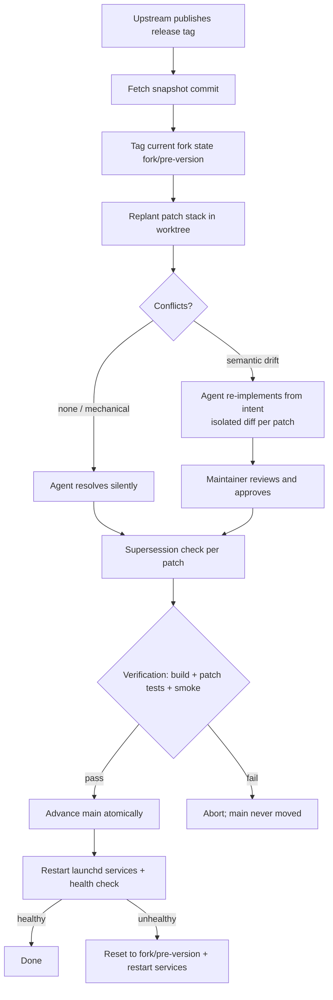

# Fork Upstream Sync Process - Plan

## Goal Capsule

- **Objective:** Establish a repeatable process for syncing the nehpz/oh-my-pi fork with upstream (can1357/oh-my-pi) releases that minimizes merge conflicts and bounds AI-agent judgment during conflict resolution. The process's first run replants the fork onto v17.0.7.
- **Product authority:** Stephen (solo maintainer; sole consumer of the fork).
- **Open blockers:** None.

---

## Product Contract

Product Contract preservation: changed: R8 clarified from "typecheck/build" to name the concrete gate (install + typecheck, conditional native rebuild) — running from source has no separate build step; F4's trigger narrowed to post-promotion health failures (pre-promotion failures abort before `main` moves). Outstanding Questions resolved by KTD1-KTD6 and U3.

### Summary

Fork-only changes live as a small linear patch stack replanted (`git rebase --onto`) onto each upstream release snapshot. Each patch carries its intent in the commit message and owns its tests. Mechanical replants proceed silently; semantic drift escalates to agent re-implementation-from-intent delivered as isolated diffs the maintainer approves. Verification ends by restarting the launchd auth-broker/gateway services and health-checking the patched behavior; every sync tags the prior state for one-command rollback.

### Problem Frame

The fork previously synced via GitHub's "Sync fork" button. At 17.0.7 the button failed — and the failure is structural, not incidental: upstream truncated its entire history. Upstream `main` and tag `v17.0.7` are the same parentless snapshot commit (`7b141199d`), sharing no ancestry with the fork's v17.0.6 base (`89d6a8f6d`). Merge-based syncing is now impossible ("refusing to merge unrelated histories") and remains impossible for every future release published this way.

The fork's standing delta is small — five upstream source files plus tests across three substantive commits (+530/−63 total) — but two of the patched files (`packages/ai/src/auth-gateway/server.ts`, `packages/coding-agent/src/cli/auth-gateway-cli.ts`) are hot files upstream churns regularly. The fork also edits two `CHANGELOG.md` `[Unreleased]` sections that upstream's release process rewrites, guaranteeing a textual conflict at every release.

Stakes are higher than a hobby checkout: the repo is a source-linked install (the daily-driver `omp` CLI runs from it) and the auth-broker/auth-gateway run as launchd services serving inference to other harnesses and tools. A broken `main` breaks production immediately.

### Key Decisions

- **Patch stack over merge history.** Fork-only commits form a linear stack atop the current upstream snapshot; syncs replant the stack rather than merging. Upstream's history truncation makes this the only viable model, and it keeps the delta permanently inspectable: `git log <snapshot>..main` is the exact fork delta.
- **Agent boundary: judgment with review.** The agent may make semantic resolution calls, but every such call must land as an isolated, reviewable diff the maintainer approves. It never resolves semantic conflicts by picking sides in conflict markers.
- **Prefer upstream, drop mine.** Fork patches are stopgaps with expiry conditions, not identity. When upstream satisfies a patch's intent, the patch retires — with its tests as the evidence.
- **Sync on release tags, not upstream main.** Fewer, chunkier syncs; the fork never runs pre-release code.
- **Force-push is acceptable.** Only the maintainer and this machine consume the fork; replanting rewrites `main` history by design.
- **Existing patches stay in-tree.** They modify upstream internals (auth-gateway response construction, cursor exec-handler logic) that no extension point can reach; an override layer would be a larger standing delta than five patched files. The out-of-tree preference applies to future additive changes only.
- **Fork patches stop editing upstream `CHANGELOG.md`.** Intent lives in commit messages instead. The existing changelog hunks are dropped during the first replant, eliminating a per-release conflict generator.

### Requirements

**Patch stack representation**

- R1. Fork-only changes exist as a linear commit stack directly atop the current upstream release snapshot; no merge commits in the fork delta.
- R2. Each patch's commit message states its intent — what behavior it changes and why — in enough detail that the change could be re-implemented from the message alone.
- R3. Each patch owns tests that fail without it and pass with it; those tests define the patch's expiry condition.
- R4. Fork patches do not modify upstream `CHANGELOG.md` files.

**Sync execution**

- R5. A sync is triggered per upstream release tag.
- R6. The replant happens in a separate worktree; `main` and the running services are untouched until verification passes.
- R7. Before `main` moves, the prior fork state is tagged (e.g. `fork/pre-<version>`) so rollback is a single reset plus service restart.
- R8. Verification gates the sync: dependency install + typecheck (`bun check`), the fork patches' own tests, and the CLI smoke probe must pass on the replanted stack; native rebuild is required only when the upstream diff touches native sources.
- R9. `main` advances atomically after verification, then the launchd auth-broker/gateway services are restarted and health-checked; the health check exercises the patched behavior (models list deduplicated, context-limit fields present).

**Conflict handling**

- R10. Mechanical conflicts (context drift, moved code, whitespace) may be resolved by the agent without escalation.
- R11. Conflicts requiring semantic judgment are not resolved textually; the agent re-implements the patch from its commit-message intent against the new upstream code and presents the result as an isolated per-patch diff for maintainer approval.

**Supersession**

- R12. Every sync tests each patch for retirement: if the patch's tests pass without it on the new upstream, the patch is retired and the retirement recorded in the sync summary.

**Delta hygiene**

- R13. Future QoL changes attempt out-of-tree surfaces (extensions, hooks, custom tools, config) before patching upstream source; only behavior-modifying changes with no extension point join the patch stack.

**First run**

- R14. The first execution of this process replants the current fork delta onto v17.0.7 (`7b141199d`), dropping the changelog hunks per R4, and leaves the daily-driver CLI and launchd services running on the new base.

### Key Flows

- F1. Routine sync
  - **Trigger:** Upstream publishes a new release tag.
  - **Steps:** Fetch snapshot; tag prior state (R7); replant stack in worktree (R6); resolve mechanical drift (R10); run supersession check (R12); verify (R8); advance `main`; bounce services and health-check (R9).
  - **Outcome:** Fork on new base, delta unchanged or shrunk, services healthy.
- F2. Semantic conflict escalation
  - **Trigger:** A patch fails to replant beyond mechanical drift (upstream rewrote the patched code).
  - **Steps:** Agent reads the patch's intent from its commit message; re-implements the change against new upstream code; presents an isolated diff with the patch's tests passing; maintainer approves or amends (R11).
  - **Outcome:** Patch re-derived, judgment reviewed, stack remains linear.
- F3. Patch retirement
  - **Trigger:** During supersession check, a patch's tests pass without it on the new upstream.
  - **Steps:** Drop the patch from the stack; note the retirement and the upstream change that superseded it in the sync log.
  - **Outcome:** Delta shrinks; upstream's version wins per the supersession decision.
- F4. Rollback
  - **Trigger:** The post-promotion health check fails after `main` moved (pre-promotion verification failures abort before `main` ever moves — see F1).
  - **Steps:** Reset `main` to `fork/pre-<version>`; restart services; investigate in the worktree without time pressure.
  - **Outcome:** Downstream tools and services restored to the last known-good state within minutes.

### Acceptance Examples

- AE1. **Covers:** R12. **Given** upstream v17.0.8 ships its own fix for duplicate `/v1/models` entries, **when** the sync's supersession check runs the fork's auth-gateway tests without the fork's patch, **then** if they pass, the patch is retired and upstream's implementation stands.
- AE2. **Covers:** R11. **Given** upstream rewrote `auth-gateway/server.ts` response construction so the fork's patch no longer applies, **when** the replant hits the conflict, **then** the agent re-implements the deduplication + context-limit behavior from the commit message intent and presents a standalone diff — it does not hand-merge conflict markers.
- AE3. **Covers:** R6, R9. **Given** a replant is in progress in the worktree, **when** any other tool invokes the source-linked CLI or the gateway serves an inference request, **then** it runs the pre-sync code — no intermediate state is ever observable.
- AE4. **Covers:** R7, F4. **Given** the post-sync gateway health check fails, **when** rollback runs, **then** one reset to the pre-sync tag plus a service restart restores inference for downstream tools.

### Scope Boundaries

- No upstreaming of fork patches — maintaining them locally is the premise.
- No migration of existing patches out-of-tree — R13 applies to future changes only.
- No continuous tracking of upstream `main` — release tags are the sync unit.
- No multi-consumer constraints (protected branches, append-only history, teammate clones) — solo maintainer, force-push by design.

### Dependencies / Assumptions

- Upstream is assumed to keep publishing history-truncated release snapshots; the process must also tolerate a return to normal linear history (replant-onto-tag works identically in both worlds).
- The launchd services `com.omp.auth-broker` and `com.omp.auth-gateway` (`KeepAlive: true`, `RunAtLoad: true`) exec `packages/coding-agent/scripts/omp` directly from this checkout; `launchctl kickstart -k` restarts them.
- The fork's current delta as verified on 2026-07-21: three substantive commits touching `packages/ai/src/auth-gateway/server.ts`, `packages/ai/src/providers/cursor.ts`, `packages/ai/src/types.ts`, `packages/coding-agent/src/cli/auth-gateway-cli.ts`, `packages/coding-agent/src/cursor.ts`, plus their tests, two changelog hunks (to be dropped), and gitignored-example config.

### Sources

- Fork delta and topology verified against git history: fork base `89d6a8f6d` (v17.0.6), upstream `main` == tag `v17.0.7` == parentless commit `7b141199d`; content drift base→17.0.7 is 27 files, +207/−128.
- Fork patch tests: `packages/ai/test/auth-gateway-models-list.test.ts`, `packages/coding-agent/test/auth-gateway-model-catalog.test.ts`, `packages/coding-agent/test/cursor-exec.test.ts`, `packages/ai/test/cursor-exec-handlers.test.ts`.
- CLI smoke probe: `omp --smoke-test` (`packages/coding-agent/src/cli.ts:360`, `runSmokeTest()`); also exercised by `scripts/install-tests/run-ci.sh`.
- Service operations: `docs/auth-broker-gateway.md` — `omp auth-broker serve` (default `127.0.0.1:8765`, `GET /v1/healthz`), `omp auth-gateway serve` (default `127.0.0.1:4000`, `GET /healthz`, `GET /v1/models`, `omp auth-gateway check [--strict]`).
- Maintenance-script convention: `#!/usr/bin/env bun` TypeScript in `scripts/` (`scripts/release.ts`, `scripts/sync-versions.ts`, `scripts/ci-test-ts.ts`).

---

## Planning Contract

### Key Technical Decisions

- KTD1. **Permanent fetch-only `upstream` remote with mirrored snapshot tags.** Add `upstream` → `https://github.com/can1357/oh-my-pi.git` (no push URL). Each sync fetches the release tag and keeps it locally as `upstream/vX.Y.Z`. Because snapshots are parentless, ancestry cannot identify the current base — the mirrored tag of the last-synced release is the durable base marker the next replant rebases from.
- KTD2. **Replant mechanics: `git rebase --onto` in a dedicated worktree, promote by hard-pointing `main` + `--force-with-lease`.** The replant runs `git rebase --onto upstream/vNEW upstream/vOLD` on a sync branch inside a worktree (e.g. `../oh-my-pi-sync`). Fast-forward promotion is impossible — the replanted head shares no ancestry with the old `main` (parentless snapshots) — so promotion moves `main` directly to the verified sync head (`git branch -f` / `git reset --hard` in the live checkout after the worktree is removed), then `git push --force-with-lease origin main`. The checkout serving the CLI and services never enters a rebase state (R6, AE3).
- KTD3. **The script is mechanical; judgment lives in the runbook.** `scripts/sync-upstream.ts` executes fetch, tagging, worktree provisioning, replant, verification, promotion, service restart, and health checks. On any conflict it stops and prints per-patch state; it never auto-resolves. The runbook (U1) defines what the agent does next — the mechanical/semantic boundary (R10/R11) is an instruction to the agent, not code.
- KTD4. **Verification pipeline order (pre-promotion, in the worktree):** `bun install` (re-applies `patchedDependencies` and the new lockfile) → `bun check` (this plus install is the build gate; R8) → the four fork patch test files → the smoke probe run through the worktree's own entry (`bun <worktree>/packages/coding-agent/src/cli.ts --smoke-test` — the `omp` on PATH resolves the live checkout and must not be used pre-promotion). Post-promotion (in the live checkout): `bun install` → `launchctl kickstart -k gui/$UID/com.omp.auth-broker` and `.../com.omp.auth-gateway` → `GET /healthz` → assert `GET /v1/models` returns deduplicated entries with numeric `context_length` (`omp auth-gateway check` output is informational only — its strict mode judges credential quotas, not service health). Native rebuild (`build:native`) runs when the worktree lacks the built addon or the upstream diff touches `crates/`.
- KTD5. **Supersession check is test-driven and flag-then-retire.** A patch's tests do not exist on the bare snapshot (they are introduced by the patch itself), so the check materializes them: check out the bare upstream snapshot, apply only the patch's test files (`git checkout <patch> -- <test paths>`), and run them. Tests pass → the script flags the patch as superseded; retirement (dropping the commit) happens in the same sync with the retirement and superseding upstream change recorded in the sync log (R12). Tests fail → the patch survives.
- KTD6. **Sync log lives in the runbook.** Each sync appends a dated summary (base old→new, per-patch outcome, retirements, re-implementations) to a `Sync log` section of `docs/fork-maintenance.md` and commits it as part of the fork stack's top — a fork-only file upstream never touches, so it is conflict-free and durable.

### Assumptions

- `launchctl kickstart -k` is sufficient to restart both services (`KeepAlive: true` would also respawn on kill; kickstart is the deliberate form).
- The gateway health assertion can reuse the expectations encoded in `packages/ai/test/auth-gateway-models-list.test.ts` against the live `/v1/models` endpoint at `127.0.0.1:4000`.

### Sequencing

U1 and U2 are independent and can proceed in parallel; U3 requires both.

---

## Implementation Units

### U1. Fork-maintenance runbook

- **Goal:** A standalone doc an agent or the maintainer can follow for any sync, encoding the judgment rules the script deliberately excludes.
- **Requirements:** R1, R2, R4, R10, R11, R12, R13.
- **Dependencies:** None.
- **Files:** `docs/fork-maintenance.md` (new).
- **Approach:** Sections: fork topology (parentless upstream snapshots, tag conventions from KTD1); the sync procedure (delegating mechanics to `scripts/sync-upstream.ts`); the conflict decision rule — mechanical drift (context moves, whitespace, neighboring-line churn) the agent resolves silently vs semantic drift (upstream rewrote the patched logic) where the agent re-implements from the patch's commit-message intent and presents an isolated diff for approval; the supersession protocol (KTD5) and how retirements are recorded; rollback (`git reset --hard fork/pre-<version>` + service restart); the patch-authoring rules for future changes (intent-bearing commit message, owned tests, no changelog edits, out-of-tree first per R13).
- **Patterns to follow:** Existing `docs/*.md` operational docs, e.g. `docs/auth-broker-gateway.md` structure and tone.
- **Test scenarios:** Test expectation: none — documentation.
- **Verification:** A reader can execute a sync end-to-end from the doc plus the script's output alone; the R10/R11 boundary is stated as a decision rule with examples, not prose gesture.

### U2. Sync automation script

- **Goal:** `scripts/sync-upstream.ts` executes every mechanical step of a sync repeatably and stops with actionable state wherever judgment is required.
- **Requirements:** R5, R6, R7, R8, R9, R12 (mechanical halves); KTD1-KTD5.
- **Dependencies:** None.
- **Files:** `scripts/sync-upstream.ts` (new), `scripts/sync-upstream.test.ts` (new).
- **Approach:** Bun script following the `scripts/release.ts` convention (`#!/usr/bin/env bun`, invoked `bun scripts/sync-upstream.ts <version|status>`). Phases: **preflight** (clean tree, resolve current base tag, fetch `upstream/vNEW`, refuse if base unknown); **snapshot** (create `fork/pre-vNEW` tag); **replant** (provision worktree, `rebase --onto`; on conflict: print per-patch status — applied / conflicted / remaining — and exit nonzero with resume instructions); **supersession** (per KTD5: materialize each patch's test files onto the bare snapshot, run them, flag passes); **verify** (KTD4 pre-promotion pipeline in the worktree, smoke probe via the worktree entry); **promote** (point `main` at the verified sync head per KTD2, `push --force-with-lease`, `bun install` in live checkout); **services** (kickstart both labels, run `omp auth-gateway check --strict`, assert `/v1/models` shape); **summary** (append sync log entry per KTD6 and print it). A `--dry-run` flag prints the resolved step plan without mutating anything. A `status` subcommand reports current base, stack contents, and pending upstream tags.
- **Execution note:** Smoke-first — prove the script with `--dry-run` and `status` against the real repo state before the first live run; unit tests cover pure helpers only.
- **Patterns to follow:** `scripts/release.ts` (phase structure, Bun Shell `$` usage per AGENTS.md), `scripts/ci-test-ts.ts` (test invocation), `scripts/sync-versions.ts` (repo-path resolution).
- **Test scenarios:**
  - Happy path: version/tag parsing helper maps `17.0.8` / `v17.0.8` to `upstream/v17.0.8`; stack enumeration helper returns the substantive patch list (excludes merge commits) from a fixture log range.
  - Edge cases: `status` with no `upstream` remote configured reports setup instructions rather than throwing; dry-run on a dirty working tree is refused with a named error.
  - Error paths: replant-phase conflict exit surfaces the conflicted patch's short SHA and subject in the failure output.
  - Test expectation for git-mutating phases: none beyond the above — proven by U3's live run; simulating full worktree/rebase lifecycles in unit tests duplicates what the first run verifies.
- **Verification:** `bun scripts/sync-upstream.ts status` and `--dry-run v17.0.7` produce correct output against the real repo before U3; `scripts/sync-upstream.test.ts` passes via `bun test scripts/sync-upstream.test.ts`.

### U3. First-run replant onto v17.0.7

- **Goal:** Execute the process end-to-end against v17.0.7, leaving the fork's daily driver and services on the new base (R14).
- **Requirements:** R14; exercises R1-R12.
- **Dependencies:** U1, U2.
- **Files:** No new source files — git history (the replanted stack), plus dropping the `packages/ai/CHANGELOG.md` and `packages/coding-agent/CHANGELOG.md` fork hunks (R4).
- **Approach:** Bootstrap the base marker first: tag the fork's existing base commit `89d6a8f6d` as `upstream/v17.0.6` (it is upstream's v17.0.6 tag SHA, already in fork history) so the script's preflight can resolve the old base. Then run the script for v17.0.7. During the replant, reword the three substantive patch commit messages to the R2 intent bar (what/why, re-implementable from message alone). Drop the changelog hunks. Expected conflicts are small (content drift v17.0.6→v17.0.7 is 27 files, +207/−128); apply the runbook's R10/R11 rule to any that appear. Record the first sync log entry per KTD6.
- **Execution note:** This unit is the process's own smoke test — treat any friction as a defect in U1/U2 and fix it there before finishing.
- **Test scenarios:** Test expectation: none — verification is the KTD4 pipeline itself (build, four patch test files, smoke probe, service health) on the replanted stack.
- **Verification:** `git log upstream/v17.0.7..main` shows only the linear fork stack with intent-bearing messages and no changelog edits; `fork/pre-v17.0.7` tag exists; both services respond healthy post-kickstart; `omp` CLI works from the source link.

---

## Verification Contract

| Gate | Command | Applies to |
|---|---|---|
| Typecheck + lint | `bun check` | U2, U3 (pre-promotion) |
| Script unit tests | `bun test scripts/sync-upstream.test.ts` | U2 |
| Fork patch tests | `bun test packages/ai/test/auth-gateway-models-list.test.ts packages/ai/test/cursor-exec-handlers.test.ts packages/coding-agent/test/auth-gateway-model-catalog.test.ts packages/coding-agent/test/cursor-exec.test.ts` | U3 (pre-promotion, in worktree) |
| CLI smoke probe | `bun <worktree>/packages/coding-agent/src/cli.ts --smoke-test` (worktree entry, never the PATH `omp`) | U3 (pre-promotion) |
| Service health | `GET http://127.0.0.1:4000/healthz`; `GET /v1/models` shape assertion (unique ids, numeric `context_length`) | U3 (post-promotion) |

Never run the pre-promotion gates against the live checkout during a sync — they run in the sync worktree (R6).

---

## Definition of Done

- Fork `main` is based on `upstream/v17.0.7`; `git log upstream/v17.0.7..main` is a linear stack of intent-bearing patches with no merge commits and no `CHANGELOG.md` edits.
- `docs/fork-maintenance.md` and `scripts/sync-upstream.ts` exist and match the behavior actually exercised in the first run.
- `fork/pre-v17.0.7` rollback tag exists; `upstream` remote and `upstream/v17.0.7` tag are configured.
- Both launchd services and the source-linked CLI run healthy on the new base (KTD4 post-promotion checks pass).
- Sync log entry recorded in `docs/fork-maintenance.md` (per-patch outcomes, any retirements or re-implementations).
- No dead-end or experimental code from abandoned approaches remains in the diff.
