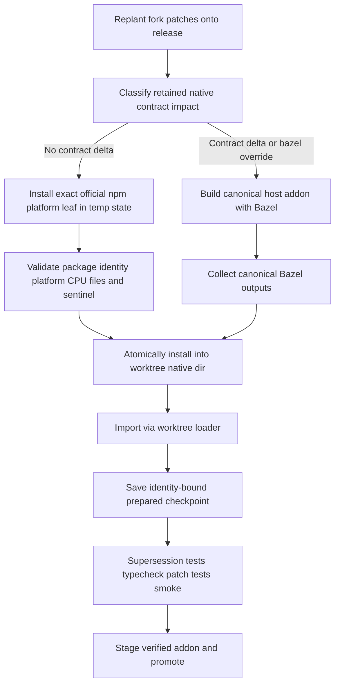

# Npm Native Upstream Sync and Patch Stack Compaction - Plan

## Goal Capsule

- **Objective:** Make routine upstream syncs acquire the exact-version official npm native addon instead of rebuilding it with Bazel, keep local Bazel builds functional for native development and true native-contract deltas, and replace the fork's accumulated replay history with a small current-intent patch stack.
- **Product authority:** Stephen (solo maintainer and sole fork consumer).
- **Open blockers:** None.

---

## Product Contract

Product Contract preservation: changed during planning only to clarify that the retained macOS 27 Rust-toolchain patch is a local-builder compatibility overlay, not a reason to rebuild an otherwise upstream-identical native artifact during every sync. This preserves the confirmed outcome: routine syncs use npm while `bun run build:native` remains functional.

### Summary

Routine release syncs will install the exact `@oh-my-pi/pi-natives-<platform>-<arch>@<release>` leaf from the official npm registry into isolated preparation space, validate its package identity and loadable version sentinel, and stage those verified addon bytes through the existing promotion machinery. Bazel remains authoritative when the fork changes the native artifact contract and remains directly runnable for local development; the retained macOS 27 toolchain update keeps that path working but does not force it during ordinary syncs. After this behavior is proven, the entire fork delta is reconstructed as a handful of self-contained current-intent commits while historical release-by-release detail remains in the runbook and solution documents rather than in replayed commits.

### Key Decisions

- **Exact-version npm natives are the routine path.** A sync for `vX.Y.Z` acquires the matching official platform leaf at exactly `X.Y.Z`; it never accepts `latest`, a semver range, a user-configured mirror, cached stale metadata, or a different platform leaf.
- **Bazel is a maintained capability and a conditional sync path.** Native source, ABI, binding, dependency, or packaging changes in the retained fork delta require a local Bazel build. The macOS 27 Rust nightly/checksum patch is retained so that path works locally, but toolchain-producer compatibility alone does not alter the desired upstream artifact and therefore does not defeat npm-default syncs.
- **Verification is behavior-first.** Registry install success or Bazel exit code is insufficient. Preparation must prove the selected `.node` files exist, package metadata matches the requested release/platform/CPU, and the worktree's native loader imports them with the expected version sentinel before a checkpoint can be marked prepared or promotion can begin.
- **No silent fallback.** If the selected npm path fails, the sync stops with its worktree and progress preserved. It does not silently build with Bazel, reuse a stale addon, or continue with a partial installation. Bazel is selected only by the impact decision or an explicit operator override.
- **Compaction preserves the final tree and current intent, not historical commit boundaries.** Product behavior, owned tests, sync machinery, native diagnostics, local Bazel support, and durable documentation survive. Repeated sync-log commits and superseded repair steps do not.
- **Upstream contribution is outside this workflow.** Implementation, verification, review, and future sync guidance must neither request nor depend on contributing any change upstream.

### Requirements

**Native preparation**

- R1. For an npm-eligible sync of `vX.Y.Z`, acquire `@oh-my-pi/pi-natives-<process.platform>-<process.arch>@X.Y.Z` from `https://registry.npmjs.org` in disposable isolated state, with registry metadata/cache behavior pinned so local npm or Bun configuration cannot redirect or satisfy the request from stale metadata.
- R2. Validate the installed leaf's exact name, version, `os`, and `cpu`, enumerate only expected `.node` files for the platform/ISA, copy them through the existing atomic addon staging path, and prove they load through the worktree's real native loader with the `X.Y.Z` version sentinel.
- R3. A missing release, unsupported platform, metadata mismatch, integrity/install error, absent expected addon, sentinel mismatch, or failed import aborts before promotion and leaves no partially selected addon in the worktree's live native directory.
- R4. Native preparation mode is deterministic and visible in output and saved progress: `npm` for no native-contract delta, `bazel` for a native-contract delta, with a deliberate `auto|npm|bazel` operator override for diagnosis and recovery.
- R5. The prepared checkpoint is bound to release, sync HEAD, preparation mode, platform/architecture, and verified addon identity. A changed HEAD/mode/platform, missing addon, or failed re-validation invalidates it; matching state may resume without reacquiring or rebuilding.

**Bazel ownership boundary**

- R6. `bun run build:native` remains functional on macOS 27 using the retained Rust nightly and synchronized Bazel archive hashes; the sync's Bazel mode continues to use the canonical `scripts/bazel-natives.ts` host target and existing staging/promotion functions.
- R7. Auto mode selects Bazel when retained patches change native Rust source, native dependency/ABI inputs, generated bindings, Bazel target/link recipe, or npm leaf packaging/selection semantics. Generated release-lock refreshes keep their existing strict drop-and-regenerate treatment.
- R8. The retained toolchain-only compatibility overlay (`rust-toolchain.toml` plus the corresponding pinned toolchain version/checksums in `MODULE.bazel`) is classified separately from an artifact-contract delta: it keeps local production possible but does not by itself force a routine sync build.

**Patch-stack compaction**

- R9. Reconstruct the complete fork delta directly atop `upstream/v17.2.4` as a small, linear, merge-free set of self-contained current-intent commits; each behavioral commit includes its owned tests and an intent-bearing message.
- R10. Preserve the pre-compaction head with an immutable local rollback tag, preserve all `upstream/v*` and `fork/pre-v*` refs, reconstruct in an isolated worktree, and do not move or publish `main` until final-tree equivalence and all verification gates pass.
- R11. The compacted tree equals the verified pre-compaction tree except for the planned npm-native sync implementation, its tests, and its documentation updates. Historical sync outcomes remain in `docs/fork-maintenance.md` and applicable solution documents, but no longer require one replayed commit per release or repair.
- R12. Promotion of compacted history uses an exact expected-old SHA and `--force-with-lease`; publishing the rewritten branch is a point-of-risk action requiring explicit confirmation immediately before the push.

**Operating constraints**

- R13. Existing isolated worktree, supersession, generated-lock retirement, atomic native staging, smoke probe, service restart/health check, and rollback behavior remain intact.
- R14. Neither the implementation nor runbook suggests upstream contribution as a remediation or prerequisite.

### Key Flows

- F1. **Routine npm-native sync**
  - **Trigger:** A new release is replanted and the retained delta has no native artifact-contract changes.
  - **Steps:** Select `npm`; create disposable install state; install the exact official core/leaf release with no cached manifest; validate name/version/os/cpu and expected addon filenames; atomically copy the addon into the worktree; import the real loader; persist the verified identity; continue the existing supersession and verification pipeline.
  - **Outcome:** The release is verified and promoted without a Bazel build.
- F2. **Native-contract sync**
  - **Trigger:** A retained patch changes native Rust/dependency/ABI/binding/build-recipe/packaging behavior, or the operator deliberately selects `--native-mode=bazel`.
  - **Steps:** Select `bazel`; run the canonical host build; remove Bazel's workspace symlink; import the result through the real loader; save a Bazel-mode checkpoint; continue unchanged verification/promotion.
  - **Outcome:** Fork-specific native behavior is represented by a locally built, verified addon.
- F3. **Preparation failure and resume**
  - **Trigger:** Registry/Bun/install/integrity/metadata/file/sentinel/import/Bazel validation fails.
  - **Steps:** Do not mark preparation complete and do not promote; remove partial temporary or destination addon state; preserve the sync branch, worktree, supersession state, and any already-safe staged recovery artifact; print the selected mode and actionable retry/override command. On rerun, re-evaluate the checkpoint against current HEAD and artifact identity.
  - **Outcome:** Production remains on the prior verified head; retry cannot mistake stale bytes for success.
- F4. **Patch-stack compaction**
  - **Trigger:** Npm and Bazel preparation paths have both passed their contract checks.
  - **Steps:** Record old `main`; create rollback tag; reconstruct six current-intent commits in an isolated worktree atop `upstream/v17.2.4`; compare the reconstructed tree to the intended old-tree-plus-feature result; run all gates; move local `main`; request point-of-risk confirmation; force-push with lease against the recorded old origin SHA; restart and health-check services.
  - **Outcome:** Same supported behavior and documentation, materially smaller patch stack, recoverable old history.

### Acceptance Examples

- AE1. **Covers R1-R4.** Given release `17.2.4`, `darwin-arm64`, and no native-contract delta, auto preparation installs only exact `@oh-my-pi/pi-natives@17.2.4` and `@oh-my-pi/pi-natives-darwin-arm64@17.2.4` packages from the official registry, reports `npm`, loads the worktree addon, and never invokes Bazel.
- AE2. **Covers R2-R3.** Given a leaf whose manifest says `17.2.3`, wrong `os`/`cpu`, or whose expected `.node` is absent, preparation fails before changing the destination addon and no prepared checkpoint is written.
- AE3. **Covers R5.** Given a valid npm checkpoint, an unchanged version/HEAD/mode/platform and present verified addon skips acquisition; changing any bound field or deleting the addon forces preparation again.
- AE4. **Covers R6-R8.** Given only the retained macOS 27 toolchain/checksum overlay, auto mode still selects npm; given a retained edit to `crates/pi-natives/**`, native dependency/ABI inputs, generated bindings, Bazel link targets, or leaf packaging/selection, auto mode selects Bazel and a failed Bazel build does not fall back to npm.
- AE5. **Covers R7, R13.** Given an exact generated `build(natives): refresh Bazel lock for vX.Y.Z` commit changing only `MODULE.bazel.lock`, replant still drops it and regenerates target-version state rather than classifying it as fork-native intent.
- AE6. **Covers R9-R11.** Given the verified pre-compaction head and reconstructed head, a full tree comparison is empty except for the reviewed npm-native plan implementation, tests, and docs; the new fork range is linear and contains the six named current-intent commits rather than release-by-release sync/repair commits.
- AE7. **Covers R10-R12.** Given any verification failure or absent force-push confirmation, origin and production `main` remain at the old SHA and the rollback tag remains usable.

### Scope Boundaries

- No changes to upstream release packaging or publishing.
- No requirement, suggestion, or prompt to contribute fixes upstream.
- No removal of Bazel, Cargo, `scripts/bazel-natives.ts`, native generation, or release tooling.
- No transparent npm-to-Bazel fallback after an acquisition failure; mode changes are explicit.
- No preservation of the old commit topology as public branch history; preservation is by rollback tag, documentation, and final-tree equivalence.
- No unrelated product refactors, test rewrites, changelog edits, or service-management changes.

### Dependencies / Assumptions

- Upstream continues to publish exact-version core and platform leaf packages to the official npm registry; release `17.2.4` currently has `@oh-my-pi/pi-natives-darwin-arm64@17.2.4` with a matching package version and platform metadata.
- Bun's installer validates registry tarball integrity. The sync additionally validates installed package identity and runtime sentinel, rather than implementing a second package-manager or hashing protocol.
- `packages/natives/scripts/gen-npm-packages.ts` remains the source for published platform targets and expected filenames; sync code must reuse its exported target data instead of adding a fourth hard-coded platform table.
- The old branch history remains reachable locally through the pre-compaction tag even after `main` is rewritten.

### Sources

- Sync state machine and checkpoints: `scripts/sync-upstream.ts` (`partitionReplantStack`, `SyncProgress`, `prepareWorktree`, `supersessionCheck`, `verify`, `promote`).
- Sync regression seams: `scripts/sync-upstream.test.ts`; Bazel driver seams: `scripts/bazel-natives.ts`, `scripts/bazel-natives.test.ts`.
- Published leaf contract: `packages/natives/scripts/gen-npm-packages.ts`, `scripts/ci-release-publish.ts`, `packages/natives/test/npm-packages.test.ts`.
- Runtime selection and sentinel contract: `packages/natives/native/loader-state.js`, `packages/natives/native/index.js`, `packages/natives/test/issue-4812-repro.test.ts`, `packages/natives/test/windows-staging.test.ts`.
- Exact-version official-registry installation precedent: `packages/coding-agent/src/cli/update-cli.ts` (`buildVersionedPackageInstallArgs`, `buildBunInstallArgs`).
- Fork invariants and history: `docs/fork-maintenance.md`, `CONCEPTS.md`, `docs/solutions/workflow-issues/upstream-sync-history-truncated-fork.md`, `docs/solutions/workflow-issues/generated-bazel-lock-refresh-replant.md`, `docs/solutions/runtime-errors/edit-tool-stale-native-addon-diff-lines-undefined.md`, `docs/solutions/build-errors/macos-bazel-native-addon-linkedit-alignment.md`.

---

## Planning Contract

### Key Technical Decisions

- KTD1. **Preparation modes are `auto | npm | bazel`, resolved once and checkpointed.** `auto` inspects the retained patch stack after generated-lock retirement. It chooses Bazel for native artifact-contract changes and npm otherwise. The explicit modes are diagnostic/recovery controls, not automatic fallbacks. Add mode parsing to the existing argument parser and include the resolved mode plus platform and addon identity in `SyncProgress`. **Governs R4-R5, R7-R8.**
- KTD2. **Classify native contract impact, not every byte that can influence a local build.** Introduce one named classifier beside `testFilesOf` and `isGeneratedLockRefreshPatch`. Force Bazel for native Rust/transitive native dependency/ABI files, generated bindings, `BUILD.bazel`/native rule changes, or native npm packaging/loader-selection changes. Treat the narrowly validated `rust-toolchain.toml` + `MODULE.bazel` Rust toolchain/checksum-only overlay as local builder compatibility and npm-eligible. Unknown changes inside the native build/package boundary fail closed to Bazel. Generated lock refresh remains governed by its existing stricter classifier. **Governs R7-R8.**
- KTD3. **Use Bun's package installer as the integrity/provenance boundary.** In a temporary directory, create a minimal package manifest and run Bun with `--no-cache` and `--registry=https://registry.npmjs.org` to install exact-version `@oh-my-pi/pi-natives` and the leaf selected from exported `LEAF_TARGETS`. Do not fetch `latest`, parse tar files, duplicate SRI verification, inherit workspace resolution, or import update-CLI internals. Bun validates package integrity; sync validates installed identity and behavior. **Governs R1-R3.**
- KTD4. **Reuse the existing addon copy/promotion seam.** Add an acquisition helper that returns a prepared source root shaped like `packages/natives/native`, then feed it through `installVerifiedNativeAddon`/`copyNativeAddons`. Validate the leaf manifest and expected file set before copying, make the destination swap atomic/no-partial, then run the worktree's normal loader import. Both npm and Bazel paths converge before supersession and promotion. **Governs R2-R3, R6, R13.**
- KTD5. **Prepared state carries an explicit evidence record.** Replace the unqualified `prepared: boolean` contract with a preparation record containing resolved mode, release, sync HEAD, platform tag, leaf package/version when applicable, expected addon basenames, and verification completion. Keep backward compatibility only at the progress-file parser boundary by treating old booleans as invalid/unprepared; do not add a runtime shim. **Governs R4-R5.**
- KTD6. **Compaction target is six current-intent commits.** Reconstruct from the verified final tree, not by mechanically squashing adjacent history:
  1. `feat(ai): enforce Cursor execution policy rejections` — exec/delete denial behavior, policy primitives, owned tests, and contract documentation.
  2. `fix(ai,coding-agent): normalize gateway model catalog metadata` — `/v1/models` deduplication, context fields/nullability, callers, and owned tests.
  3. `chore(dev): preserve fork-local development configuration` — local config example/ignore and JetBrains MCP selection.
  4. `fix(natives): diagnose and safely promote workspace addons` — loader sentinel/staleness diagnostics, atomic staging/promotion behavior, tests, and native runtime docs.
  5. `build(natives): keep local Bazel builds working on macOS 27` — Rust nightly, synchronized toolchain hashes/lock state, Bazel build support, and its solution record.
  6. `chore(fork): automate parentless syncs with verified npm natives` — the consolidated sync script/tests, runbook, concepts, historical sync log, generated-lock handling, and npm-default preparation.
  If a file spans concerns, stage by semantic hunk. The final tree-equivalence gate, not convenience of path staging, is authoritative. **Governs R9-R11.**
- KTD7. **Rewrite locally first; publish only after an explicit safety gate.** Record local and origin old SHAs, create `fork/pre-compaction-v17.2.4`, build the six commits in an isolated worktree rooted at `upstream/v17.2.4`, verify the full tree and behavior, then move local `main`. Immediately before `git push --force-with-lease=main:<recorded-origin-sha> origin main`, request explicit confirmation with the exact remote/ref/old/new SHAs. **Governs R10-R12.**

### Sequencing

U1 establishes the shared classifier and preparation-state contract. U2 and U3 then implement the npm and Bazel branches against that contract. U4 integrates verification/resume/promotion and updates operating documentation. Only after U1-U4 pass end to end does U5 reconstruct history; U6 verifies the compacted result and performs the separately confirmed publication/restart tail.

---

## Implementation Units

### U1. Native-impact decision and progress contract

- **Goal:** Make native preparation selection deterministic, explainable, and safe to resume.
- **Requirements:** R4-R5, R7-R8.
- **Dependencies:** None.
- **Files:** `scripts/sync-upstream.ts`, `scripts/sync-upstream.test.ts`.
- **Approach:** Extend `parseArgs` with `--native-mode=auto|npm|bazel`. Add a native-contract-impact classifier over retained patches after generated-lock partitioning, using existing `changedFilesOf` and a narrowly testable toolchain-only exception; return the resolved mode plus reasons for console output. Replace boolean preparation state with a typed evidence record keyed to version, exact sync HEAD, mode, platform tag, and addon basenames. `loadProgress` treats legacy/malformed/mismatched evidence as unprepared. Ensure changed HEAD, explicit mode, platform, missing addon, or failed identity validation invalidates the checkpoint.
- **Patterns to follow:** Existing strict `isGeneratedLockRefreshPatch`/`partitionReplantStack` classifiers and atomic `loadProgress`/`saveProgress`; no source-text tests.
- **Test scenarios:** JS/docs-only patch selects npm; native Rust, binding, native dependency, link recipe, or leaf packaging patch selects Bazel; exact toolchain-only overlay selects npm; broader/unknown native-boundary changes fail closed to Bazel; explicit mode wins; generated lock-only refresh retains its separate drop behavior; legacy or mismatched checkpoints reprepare.
- **Verification:** `bun test scripts/sync-upstream.test.ts` and exact assertions on selected mode/reason and persisted evidence transitions.

### U2. Exact-version npm native acquisition

- **Goal:** Produce a verified host addon source from the official exact-version npm leaf without touching the worktree until validation succeeds.
- **Requirements:** R1-R3.
- **Dependencies:** U1.
- **Files:** `scripts/sync-upstream.ts`, `scripts/sync-upstream.test.ts`, `packages/natives/scripts/gen-npm-packages.ts`, `packages/natives/test/npm-packages.test.ts` if a small reusable target/filename export is needed.
- **Approach:** Reuse `LEAF_TARGETS` and expose the existing expected-filename helper rather than duplicating platform data. Create a disposable install root with a minimal manifest; run exact core + leaf install with official-registry and no-cache flags; inspect the installed leaf manifest for exact name/version/os/cpu and ensure the addon set is a non-empty subset of expected host filenames (including x64 baseline/modern behavior). Copy validated files into a staged source layout only after every check passes. Clean disposable and partial staging state on every failure while preserving the sync worktree/progress for retry.
- **Patterns to follow:** Exact official-registry package pinning in `packages/coding-agent/src/cli/update-cli.ts`; temp/staging and atomic copy helpers already in `scripts/sync-upstream.ts`; generated leaf definitions in `gen-npm-packages.ts`.
- **Test scenarios:** Exact darwin-arm64 success; x64 baseline/modern file set; unsupported platform; missing exact release; wrong package name/version/os/cpu; empty/unexpected file set; installer failure; cleanup after failure. Use injectable process/install seams or a local package fixture for deterministic unit tests—never mutate global Bun/process state across files.
- **Verification:** Focused sync/native-package tests plus one real official-registry acquisition of the current release in isolated temporary state, asserting the selected leaf manifest and addon files.

### U3. Unified preparation and maintained Bazel path

- **Goal:** Converge npm and Bazel output into one verified worktree addon contract while keeping local builds operational.
- **Requirements:** R2-R8, R13.
- **Dependencies:** U1, U2.
- **Files:** `scripts/sync-upstream.ts`, `scripts/sync-upstream.test.ts`, `scripts/bazel-natives.ts` only if an existing source/destination seam must be exposed, `MODULE.bazel`, `MODULE.bazel.lock`, `rust-toolchain.toml` (retain current compatible values; do not gratuitously change them).
- **Approach:** Split current `prepareWorktree` into dependency install, selected native producer, common atomic install, Bazel-symlink cleanup, real loader import, tracked-clean assertion, and checkpoint save. Npm mode consumes U2's staged source; Bazel mode calls the existing `bun run build:native`/canonical driver. Neither catches failure to invoke the other. Confirm the macOS 27 toolchain patch and lock stay synchronized and that direct local `bun run build:native` remains usable.
- **Patterns to follow:** `stageVerifiedNativeAddon`, `installVerifiedNativeAddon`, and version-keyed recovery staging; canonical Bazel host target in `scripts/bazel-natives.ts`; stale-addon sentinel guidance in `loader-state.js`.
- **Test scenarios:** Mode invokes only its selected producer; either producer failure leaves old destination or no destination intact; successful producer installs then imports; import/sentinel failure prevents checkpoint; Bazel workspace symlink removed before Bun test discovery; Bazel never silently falls back to npm.
- **Verification:** `bun test scripts/sync-upstream.test.ts scripts/bazel-natives.test.ts`; actual `bun run build:native`; actual `bun -e 'await import("./packages/natives/native/index.js")'` after each producer path.

### U4. End-to-end sync integration and operating documentation

- **Goal:** Carry preparation evidence through supersession, verification, promotion, recovery, and operator guidance.
- **Requirements:** R4-R5, R13-R14.
- **Dependencies:** U3.
- **Files:** `scripts/sync-upstream.ts`, `scripts/sync-upstream.test.ts`, `docs/fork-maintenance.md`, `CONCEPTS.md`, relevant existing native/sync solution docs when their claims become stale.
- **Approach:** Show selected mode and impact reasons before acquisition. Update resume checks and `--verify-only` behavior to require valid preparation evidence. Preserve existing staged-addon recovery and promotion order. Document default npm flow, explicit mode overrides, fail-closed behavior, the local-builder/toolchain distinction, checkpoint invalidation, and exact retry commands. Remove or correct obsolete claims that every sync always rebuilds. State the upstream-contribution non-goal directly in the runbook.
- **Patterns to follow:** Current runbook's command-first recovery sections, current Sync Log, and canonical vocabulary in `CONCEPTS.md`.
- **Test scenarios:** Full phase skip with valid evidence; invalid evidence reruns preparation; acquisition failure leaves promotion unreachable; promotion recovery still installs the version-keyed staged addon; `status` identifies mode/evidence; no duplicate tests through Bazel symlink.
- **Verification:** Focused sync tests; `bun check`; all patch-owned tests; `bun <absolute-worktree>/packages/coding-agent/src/cli.ts --smoke-test`; a `--verify-only` sync exercise proving the npm path completes without invoking Bazel.

### U5. Reconstruct the six-commit fork patch stack

- **Goal:** Replace accumulated sync/repair history with a small current-intent stack without losing supported behavior or historical documentation.
- **Requirements:** R9-R11, R14.
- **Dependencies:** U4 and all U1-U4 verification passing.
- **Files:** Git history and the full fork delta; no additional source changes beyond reviewed U1-U4 output.
- **Approach:** Record `old-main` and `old-origin-main`; create immutable local `fork/pre-compaction-v17.2.4`; create an isolated compaction worktree/branch at `upstream/v17.2.4`; materialize the verified final tree; stage semantic hunks into the exact six groups in KTD6, including owned tests with behavior; retain historical sync entries as content in the consolidated fork workflow commit; verify each commit is self-contained, linear, and free of released upstream changelog edits or generated historical lock-refresh commits. Compare the resulting tree against the intended verified tree and stop on any unexplained byte difference.
- **Patterns to follow:** Patch Stack/Replant/Promotion vocabulary, isolated worktree policy, generated-lock retirement rule, and intent-bearing commit messages in `docs/fork-maintenance.md` and `CONCEPTS.md`.
- **Test scenarios:** Tree-equivalence check; exact six-commit linear range; no merge commits; each behavioral test appears no later than its owning implementation; historical docs remain present; upstream/fork rollback refs unchanged; only one target-version generated lock state remains.
- **Verification:** Empty `git diff --stat <verified-tree>..<compacted-tree>` (after accounting for the already-reviewed U1-U4 delta), commit-range inspection, and all U4 gates rerun from the compacted worktree.

### U6. Promote, publish, and validate compacted history

- **Goal:** Move production and origin to the verified compacted head with a precise rollback path.
- **Requirements:** R10-R13.
- **Dependencies:** U5.
- **Files:** Git refs, live checkout native addon, launchd services; no new code.
- **Approach:** Confirm local old/new and remote expected-old SHAs. Move local `main` only after the compacted worktree passes every gate; stage/install the exact verified addon through existing promotion code. Immediately before external publication, ask for explicit confirmation naming `origin/main`, old SHA, new SHA, and force-with-lease. On approval, push only with `--force-with-lease=main:<old-origin-sha>`. Run `bun install`, restart auth-broker and auth-gateway, and execute the established health/model checks. On post-promotion failure, reset to `fork/pre-compaction-v17.2.4`, reinstall its matching addon, restart services, and report the failed gate.
- **Patterns to follow:** Existing `promote`, `installAndCleanStagedNativeAddon`, `bounceServices`, rollback tag, and health-check flow.
- **Test scenarios:** Lease mismatch refuses publication; no confirmation means no push; staged addon recovery survives worktree removal; unhealthy service triggers documented rollback; successful health reports deduplicated model IDs and context lengths.
- **Verification:** Origin `main` equals compacted head only after confirmed lease push; `upstream/v17.2.4` is its base ancestor; worktree clean; `omp auth-gateway check`/health endpoints and 304-model catalog invariant pass; rollback tag resolves to old head.

---

## Verification Contract

Run gates in this order; stop before compaction or promotion on the first failure.

1. **Classifier/progress:** `bun test scripts/sync-upstream.test.ts`.
2. **Native packaging/driver:** `bun test scripts/bazel-natives.test.ts packages/natives/test/npm-packages.test.ts packages/natives/test/issue-4812-repro.test.ts packages/natives/test/windows-staging.test.ts`.
3. **Npm producer smoke:** acquire the exact current host leaf from the official registry in temporary state, validate its manifest/files, install it into an isolated worktree, and import `packages/natives/native/index.js` with expected sentinel.
4. **Bazel producer smoke:** run `bun run build:native` from clean state, remove the workspace symlink, and import the same real loader.
5. **Repository gates:** `bun check`, every patch-owned test file selected by the sync script, and `bun <absolute-worktree>/packages/coding-agent/src/cli.ts --smoke-test`.
6. **Sync smoke:** run a `--verify-only` release-sync scenario that selects npm in auto mode and observe that verification completes without a Bazel invocation.
7. **Compaction equivalence:** compare full verified and compacted trees, inspect the exact six-commit linear range, and rerun gates 1-6 from the compacted worktree.
8. **Post-promotion:** restart services, assert health endpoints, unique provider/model IDs, and numeric `context_length`; verify clean checkout and rollback tag.

Tests must assert observable state transitions and failures, not implementation source text. Registry-specific unit tests use deterministic fixtures; the one real-registry smoke is the proof that publication, installer integrity, package shape, and runtime loading compose.

## Risks and Mitigations

- **Classifier false negative loads an upstream binary for fork-specific native behavior.** Fail closed for unknown files in the native boundary; test every named source/dependency/binding/build/packaging class; keep explicit Bazel override.
- **Classifier false positive makes npm default unreachable because of the retained toolchain patch.** Model toolchain compatibility as its own narrow structural classification and lock it with a regression test demonstrating npm selection for the current compacted stack.
- **Registry install succeeds with stale or wrong bytes.** Pin official registry, exact packages, and no-cache metadata; validate manifest/platform/files; load through the real version sentinel before checkpointing.
- **Partial copy destroys a previously usable worktree addon.** Validate entirely in temporary state and reuse atomic staging/rename semantics; cleanup on failure.
- **Checkpoint reuses bytes across changed code or host.** Bind evidence to version, exact HEAD, resolved mode, platform tag, filenames, and successful import; missing or legacy fields invalidate.
- **Compaction silently drops behavior.** Reconstruct from the final verified tree, group by semantic hunk, require empty full-tree comparison, and rerun the complete suite from the compacted worktree.
- **History rewrite overwrites unexpected remote work.** Record origin SHA, use exact force-with-lease, request point-of-risk confirmation, and keep the pre-compaction tag.
- **Resident process still holds old native code after disk promotion.** Preserve mandatory service restart; never claim a disk replacement repaired a running process.

## Definition of Done

- Routine auto sync demonstrably selects and loads the exact official npm native leaf without running Bazel.
- A real native-contract delta demonstrably selects Bazel, and local `bun run build:native` works on macOS 27.
- Npm failures are fail-closed, leave no partial addon/checkpoint, and never trigger an implicit Bazel fallback.
- Resume state is identity-bound and invalidates on every specified change.
- Existing supersession, generated-lock, staging, smoke, promotion, service-health, and rollback contracts still pass.
- The fork delta atop `upstream/v17.2.4` is exactly the six current-intent commits in KTD6, with final-tree equivalence proven and historical sync detail retained in docs.
- No upstream-contribution request or dependency appears in code, docs, or operator output.
- Origin is rewritten only after explicit point-of-risk confirmation and exact force-with-lease; services are healthy afterward and the old head remains reachable by rollback tag.
